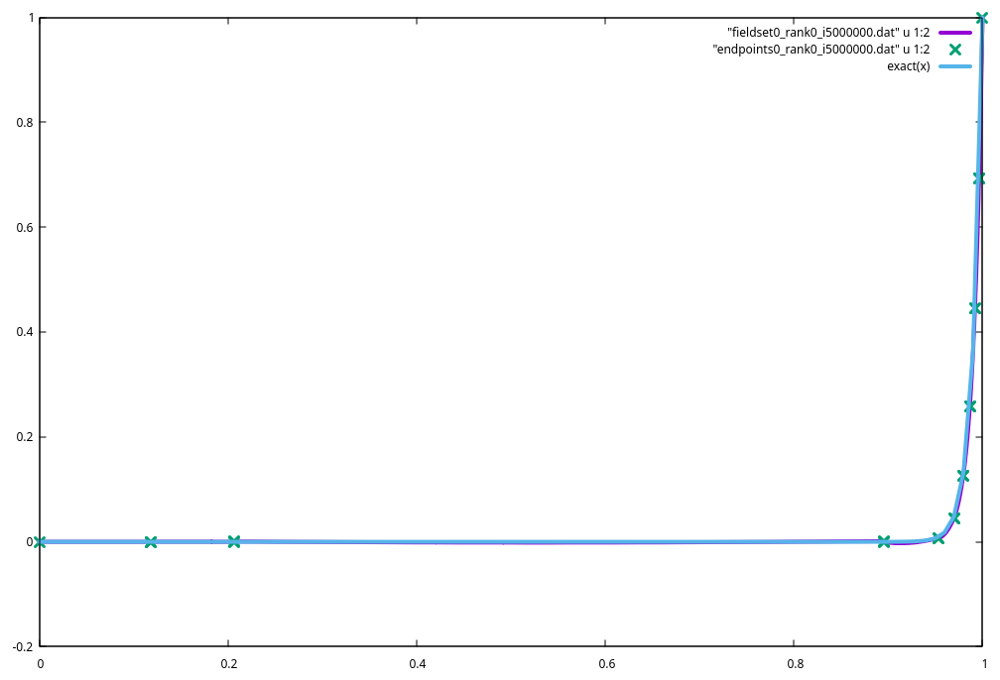

.. ICEicle documentation master file, created by
   sphinx-quickstart on Thu Apr 25 12:04:09 2024.
   You can adapt this file completely to your liking, but it should at least
   contain the root `toctree` directive.

.. role:: cpp(code)
   :language: cpp

Welcome to ICEicle's documentation!
===================================

.. toctree::
   :maxdepth: 2
   :caption: Contents:

Indices and tables
==================

* :ref:`genindex`
* :ref:`search`
* :ref:`Introduction`
* :ref:`Lua Interface`
* :ref:`API`

Introduction
============
ICEicle is a research finite element code aimed at implementing MDG-ICE.

Technical Background
====================
Partial differential equations (PDEs) are expressed on a domain of interest in :math:`d` dimensional space. 
This domain :math:`\Omega \subset \mathbb{R}^d` is then tesselated by non overlapping elements :math:`\mathcal{K}` in a tesselation :math:`\mathcal{T}`.
We also consider the set of element interfaces :math:`\mathcal{E}` such that :math:`\cup_{\Gamma\in\mathcal{E}} = \cup_{\mathcal{K}\in\mathcal{T}} \partial \mathcal{K}`.

The primary goal is to represent the solution to the PDE accurately by a set of functions on the domain. 
We generally consider PDEs in the form of a **conservation law**; many physical processes follow conservation laws.

.. math::
   \nabla\cdot\mathcal{F}(\mathbf{U}) = 0

Where the quantities in :math:`\mathbf{U}` are **conserved quantities**, such as mass, momentum, and energy. 
We denote the number of conserved quantities with :math:`m`. 
Then the **conservative flux** :math:`\mathcal{F} : \mathbb{R}^m \mapsto \mathbb{R}^{m\times d}`.

If the problem is time-dependent, it is common to treat the time dimension separately and use a conservative flux defined on the spatial dimensions :math:`F : \mathbb{R}^m \mapsto \mathbb{R}^{m\times d_x},\;d_x = d - 1`.
In this case our conservation law becomes:

.. math::
   
   \frac{\partial \mathbf{U}}{\partial t} + \frac{\partial F_j(\mathbf{U})}{\partial x_j} = 0

============================
Function Spaces
============================

We want to find functions that best solve the PDE, so we must consider spaces of functions. First we need a few definitions.

A function :math:`f` is :math:`C^0(\Omega)` or **continuous** on a domain :math:`\Omega` if for all :math:`x_0 \in \Omega`

1. :math:`f(x_0)` is defined 
2. :math:`\lim_{x\to x_0}` exists
3. :math:`\lim_{x\to x_0} = f(x_0)`

For more details see the `Mathworld Article <https://mathworld.wolfram.com/ContinuousFunction.html>`_.

A function is :math:`C^k` if the function, and every derivative of the function up to the :math:`k\text{th}` derivative is continuous.

We define the :math:`L^p` norm by: 

.. math::

   \lVert f \rVert_{L^p(\Omega)} := \Bigg( \int_\Omega | f | ^p \;dx \Bigg)^{\frac{1}{p}}

A function is :math:`L^p` integrable or in the :math:`L^p` space if :math:`\lVert f \rVert_{L^p(\Omega)} < \infty`

The Sobolev space :math:`V^{k, p}` is defined as 

.. math::

   V^{s, p}(\Omega) := \{ v \in L^p(\Omega) : \forall | \alpha | \leq s, \partial^\alpha_x v \in L^p(\Omega) \}

Here :math:`\alpha` is a multi index.
So this is saying for all of the partial derivatives of f who's total order are less than or equal to :math:`s`, that derivative is in :math:`L^p`.
When :math:`p` is left unspecified, we assume :math:`p=2`.

The space :math:`H^1` has :math:`L^2` integrable functions and first derivatives, and is defined as: 

.. math::

   H^1(\Omega) := V^{1, 2}(\Omega)

Using these spaces we define a few spaces to solve the vector-valued PDE with :math:`m` components on :math:`\Omega \subset \mathbb{R}^d`.

The first is used to represent the PDE solution by functions that are continuous internal to elements but can be discontinuous between elements. 
This **broken Soboloev space** is used for Discontinuous Galerkin methods.
Here, :math:`v\rvert_{\mathcal{K}}` is the function restricted to the domain of the element :math:`\mathcal{K}`.

.. math::

   V_u := \{ v \in [L^2(\Omega)]^m \;|\; \forall \mathcal{K} \in \mathcal{T},\; v\rvert_\mathcal{K} \in [H^1(\Omega)]^m \}

The next is another broken Sobolev space for primal formulations (explored in detail by Arnold et al [Arnold2000]_).

.. math::

   
   V_\sigma := \{ v \in [L^2(\Omega)]^{m\times d_x} \;|\; \forall \mathcal{K} \in \mathcal{T},\; v\rvert_\mathcal{K} \in [H^1(\Omega)]^{m \times d_x} \}

Where :math:`d_x = d-1` only considers the spatial dimensions.
Also define :math:`W_u` and :math:`W_\sigma` as the single valued trace spaces of :math:`V_u` and :math:`V_\sigma` respectively.

Next is a continuous function space over the domain, which will be used to represent the PDE solution, 
or continuous test function space for the interface conservation. 

.. math::

   V_{c} = \{ v \in [H^1(\Omega)]^m \}

and a corresponding space for primal formulations 

.. math::

   V_{p} = \{ v \in [H^1(\Omega)]^{m \times d_x} \}

And finally a continuous function space that will be used to aid in discretizing the mesh.

.. math:: 

   V_{y} = \{ v \in [H^1(\Omega)]^d \}

============================
Inner Products
============================

Weak formulations are composed out of :math:`L^2` inner products on the function spaces. 
We define the following notations for the inner products for scalars :math:`a, b` and vectors :math:`\mathbf{a}, \mathbf{b}`:

.. math::
   \langle a, b \rangle_\mathcal{K} &:= \sum_{\mathcal{K}\in\mathcal{T}} \int_\mathcal{K} a b \; d\mathcal{K} \\
   \langle \mathbf{a}, \mathbf{b} \rangle_\mathcal{K} &:= \sum_{\mathcal{K}\in\mathcal{T}} \int_\mathcal{K} \mathbf{a}\cdot\mathbf{b} \; d\mathcal{K} \\
   \langle a, b \rangle_\Gamma &:= \sum_{\Gamma\in\mathcal{E}} \int_\mathcal{\Gamma} a b \; d\Gamma \\
   \langle \mathbf{a}, \mathbf{b} \rangle_\Gamma &:= \sum_{\Gamma\in\mathcal{E}} \int_\Gamma \mathbf{a}\cdot\mathbf{b} \; d\Gamma

============================
MDG-ICE Formulation
============================

Consider the the conservation law:

.. math::

   \nabla \cdot \mathcal{F}(\mathbf{U}) = 0

Where the conservative flux :math:`\mathcal{F} : \mathbb{R}^m \mapsto \mathbb{R}^{m \times d}` can be split into convective and viscous components as follows:

.. math::

   \nabla \cdot \mathcal{F}^c(\mathbf{U}) + \nabla \cdot \mathcal{F}^v(\mathbf{U}, \nabla\mathbf{U}) = 0 \\
   \mathcal{F}^c = \begin{pmatrix}
      F^c_j \\ 
      \mathbf{U}
   \end{pmatrix}, 
   \quad \mathcal{F}^v = \begin{pmatrix} G_{ikrs}(U)\frac{\partial U_r}{\partial x_s} \\ 0 \end{pmatrix}

Here, the non-calligraphic :math:`F^c : \mathbb{R}^{m} \mapsto \mathbb{R}^{m \times d_x}` represents the spatial components of the convective flux. 
:math:`G_{ikrs}(\mathbf{U}) \in \mathbb{R}^{m\times d_x \times m \times d_x}` is the homogeneity tensor of the viscous flux, implying the viscous flux must be homogeneous with respect to the conservative variable gradients.
Also note that :math:`k` and :math:`s` are indices over the physical dimensions and omit the time dimension.

----------------------------
Original MDG-ICE Formulation
----------------------------
The original formulation recasts the conservation law into a system of first order equations with an auxiallary variable :math:`\sigma \in V_\sigma`.

.. math::

   \mathcal{F}(\mathbf{U}, \sigma) = \nabla\cdot \mathcal{F}^c + \nabla \cdot \begin{pmatrix} \sigma \\ 0 \end{pmatrix} &= 0 \text{ in } \mathcal{K} \quad&\forall \mathcal{K} \in \mathcal{T}\\
   \sigma - G_{ikrs}\frac{\partial U_r}{\partial x_s} &= 0 \text{ in } \mathcal{K} &\forall \mathcal{K} \in \mathcal{T} \\
   [[ n\cdot \mathcal{F}(\mathbf{U}, \sigma) ]] &= 0 \text{ on } \Gamma &\forall \Gamma \in \mathcal{E} \\
   \overline{G}_{ikrs}(U) [[ U_r n_s ]] &= 0 \text{ on } \Gamma &\forall \Gamma \in \mathcal{E} \\

where :math:`n` is the outward unit normal vector to the edge :math:`\Gamma`, :math:`\overline{u} = \frac{u_L + u_R}{2}` is the average operator,
and :math:`[[u]] = u_R - u_L` is the jump operator.

This results in the following weak form:

.. math::

   \langle \nabla \cdot \mathcal{F}(\mathbf{U}, \sigma), v_u \rangle_\mathcal{K}
   + \langle \sigma - G_{ikrs}\frac{\partial U_r}{\partial x_s}, v_\sigma \rangle_\mathcal{K} \\
   - \langle [[ n\cdot \mathcal{F}(\mathbf{U}, \sigma) ]], w_u \rangle_\Gamma
   - \langle \overline{G}_{ikrs}(U) [[ U_r n_s ]], w_\sigma \rangle_\Gamma \\
   = 0  \quad \forall v_u\in V_u, v_\sigma \in V_\sigma, w_u \in W_u, w_\sigma \in W_\sigma

The domain integrals :math:`\langle \cdot, \cdot \rangle_\mathcal{K}` can be integrated by parts and resulting fluxes in the trace integrals replaced by consistent and conservative numerical fluxes.

-------------------- 
Proposed Formulation
--------------------

.. math:: 
   \mathcal{F}(\mathbf{U}, \nabla \mathbf{U}) &= 0 \text{ in } \mathcal{K} \quad&\forall \mathcal{K} \in \mathcal{T}\\
   [[ n\cdot \mathcal{F}(\mathbf{U}, \sigma) ]] &= 0 \text{ on } \Gamma &\forall \Gamma \in \mathcal{E} \\
   \overline{G}_{ikrs}(U) [[ U_r n_s ]] &= 0 \text{ on } \Gamma &\forall \Gamma \in \mathcal{E} \\

We want to also investigate if the last set of equations (the interface conservation for the constitutive relation) is necessary. 
The corresponding weak form is:

.. math:: 

   \langle \nabla \cdot \mathcal{F}(\mathbf{U}, \nabla \mathbf{U}), v_u \rangle_\mathcal{K} \\
   - \langle [[ n\cdot \mathcal{F}(\mathbf{U}, \sigma) ]], v_c \rangle_\Gamma
   - \langle \overline{G}_{ikrs}(U) [[ U_r n_s ]], v_p \rangle_\Gamma \\
   = 0  \quad \forall v_u\in V_u, v_c \in V_c, v_p \in V_p

-------------------------
Geometry Parameterization
-------------------------

For the purpose of the discretization the geometry (described by node coordinates) exists in the :math:`V_y` space. However, this neglects the enforcement of boundary conditions.
Corrigan et al. introduce an operator :math:`b : V_y \mapsto V_y` that enforces the boundary condition.
We, instead parameterize the geometry by a function :math:`g : \mathbb{R}^{n_p} \mapsto V_y`. 
Where :math:`n_p` is the number of parameters for the parameterization. 
This also allows for parameterizations like setting the final time by a single input variable.

----------------------
Variational Derivative
----------------------

Define the variational derivative of a functional :math:`\Pi(u)` as: 

.. math::

   \Pi_u(u; \hat{u}) := \frac{d}{d\epsilon} \Pi(u + \epsilon \hat{u}) \Bigr|_{\epsilon = 0}

---------------------
Regularization
---------------------

Let :math:`\tilde{u} \in \mathbb{R}^{n_p}` represent the geometry parameterization.
Isotropic Laplacian-type mesh regularization results in the following operator:

.. math::

   -\langle \nabla g_\tilde{u}(\tilde{u}; \hat{u}), \nabla g_\tilde{u}(\tilde{u}; \hat{v}) \rangle_\mathcal{K}

If we denote the element stiffness matrix by 

.. math::

   K_\mathcal{K} = \int_\mathcal{K} \nabla u \cdot \nabla v \; d\mathcal{K}

Then this isotropic Laplacian-type mesh regularization can be written as:

.. math::

   -(g_\tilde{u}(\tilde{u}; \hat{u})\mathbf{I})^T K_\mathcal{K} g_\tilde{u}(\tilde{u}; \hat{v}) \mathbf{I}

which can be implemented as a simple loop over the elements.

Lua Interface
=============
The :code:`conservation_law` miniapp exposes functionality via input decks written in Lua to allow for dynamic setup of a variety of problems. 
The :code:`heat_eqn_miniapp` miniapp will follow some of these conventions but uses an outdated interface so may be different. 
Check the :code:`examples` directory for some example input files. 
To enable this functionality make sure cmake can access Lua development libraries and turn on the cmake option :code:`ICEICLE_USE_LUA`.
This will download the `sol2 <https://github.com/ThePhD/sol2>`_ library through the :code:`FetchContent` mechanism.

Lua input files should return a single table with all of the configuration options. 
These configuration options are split into modules for each overarching table (see below)
For example - the following input file solves a diffusion equation in 1d:

.. code-block:: lua
   :linenos:

   local fourier_nr = 0.0001

   local nelem_arg = 8;

   return {
      -- specify the number of dimensions (REQUIRED)
      ndim = 1,

      -- create a uniform mesh
      uniform_mesh = {
         nelem = { nelem_arg },
         bounding_box = {
               min = { 0.0 },
               max = { 2 * math.pi }
         },
         -- set boundary conditions
         boundary_conditions = {
               -- the boundary condition types
               -- in order of direction and side
               types = {
                  "dirichlet", -- left side
                  "dirichlet", -- right side
               },

               -- the boundary condition flags
               -- used to identify user defined state
               flags = {
                  0, -- left
                  0, -- right
               },
         },
         geometry_order = 1,
      },

      -- define the finite element domain
      fespace = {
         -- the basis function type (optional: default = lagrange)
         basis = "legendre",

         -- the quadrature type (optional: default = gauss)
         quadrature = "gauss",

         -- the basis function order
         order = 2,
      },

      -- describe the conservation law
      conservation_law = {
         -- the name of the conservation law being solved
         name = "burgers",
         mu = 1.0,

      },

      -- initial condition
      initial_condition = function(x)
         return math.sin(x)
      end,

      -- boundary conditions
      boundary_conditions = {
         dirichlet = {
               0.0,
         },
      },

      -- solver
      solver = {
         type = "rk3-tvd",
         dt = fourier_nr * (2 * math.pi / nelem_arg) ^ 2,
         tfinal = 1.0,
         ivis = 1000
      },

      -- output
      output = {
         writer = "dat"
      }
   }

==============
Dimensionality
==============

:code:`ndim` : specifies the number of dimensions.

This will affect the sizes of many input arrays and internally sets the ``ndim`` template parameter. 
For spacetime simulations this is the number of spatial dimensions +1 for the time dimension.

====
Mesh
====

------------
Uniform Mesh
------------

All simulations need a mesh to define and partition the geometric domain. Currently only uniform hyper-cube mesh generation is supported.

:code:`uniform_mesh` : creates a uniform mesh 

**Required Members**

* :code:`nelem` : the number of elements in each direction

  This is a table of size ``ndim`` and is ordered in axis order (x, y, z, ...)

* :code:`bounding_box` : the bounding box of the mesh 

   * :code:`min` : the minimal corner of the mesh - if the mesh is the bi-unit hypercube, this is the :math:`\begin{pmatrix} -1 & -1 & ... \end{pmatrix}^T` corner of the mesh

   * :code:`max` : the maximal corner of the mesh - if the mesh is the bi-unit hypercube, this is the :math:`\begin{pmatrix} 1 & 1 & ... \end{pmatrix}^T` corner of the mesh

* :code:`boundary_conditions` : table to define the boundary condition identifiers for the domain faces 

   The tables in this table follow the face number ordering for Hypercube-type elements. 
   Considering a domain :math:`[-1, 1]^n` - this ordering is first the :math:`-1` side for each dimension in order (x, y, z, ...), 
   then the :math:`+1` sides. 

   In 2D this is: -x (left), -y (bottom), +x (right), +y (top).

   * :code:`types` : the :cpp:enum:`iceicle::BOUNDARY_CONDITIONS` type (check for documentation entries with "Lua name" for the case insensitive name)

   * :code:`flags` : an integer flag to pass to the boundary condition. 
     For Dirichlet and Neumann boundary conditions, this is the (0-indexed) index of the value or function 
     in the table where these boundary conditions are configured later.

**Optional Members**

* ``geometry_order`` : the polynomial order of the basis functions defining the geometry 

   (defaults to 1)

----
gmsh
----

The ``gmsh`` table defines a mesh by reading in a gmsh file 

**Required Table Members**

* ``file`` the relative or absolute path to the ``.msh`` file (using MSH format 4.1)

* ``bc_definitions`` The boundary conditions to prescribe for each physical object. 
   These definitions are tables that are pairs of boundary condition types (:cpp:enum:`iceicle::BOUNDARY_CONDITIONS`) and integer flags 

.. code-block:: lua 

   bc_definitions = {
      -- 1: initial condition (dirichlet, flag 1)
      { "dirichlet", 1 },

      -- 2: right (extrapolation, flag 0)
      { "extrapolation", 0 },

      -- 3: spacetime-future
      { "spacetime-future", 0 },

      -- 4: left (dirichlet, flag 0)
      { "dirichlet", 0 },
   },

.. warning::
   Currently the entity tag is used for ordering so these definitions are in order of entity creation.

   for example, the bounding box generated by the following python code, is ordered bottom, right, top, left:

.. code-block:: python
   
   import gmsh;

   # mesh size parameter
   lc = 0.005

   # setup the gmsh model
   gmsh.initialize()
   gmsh.model.add("gmsh_model")

   # =========================
   # = make the bounding box =
   # =========================
   bp1 = gmsh.model.geo.addPoint(0, 0, 0, lc)
   bp2 = gmsh.model.geo.addPoint(1, 0, 0, lc)
   bp3 = gmsh.model.geo.addPoint(1, 1, 0, lc)
   bp4 = gmsh.model.geo.addPoint(0, 1, 0, lc)

   bl1 = gmsh.model.geo.addLine(bp1, bp2);
   bl2 = gmsh.model.geo.addLine(bp2, bp3);
   bl3 = gmsh.model.geo.addLine(bp3, bp4);
   bl4 = gmsh.model.geo.addLine(bp4, bp1);

=======
FESpace
=======

:code:`fespace` : this table defines the finite element space 

**Optional Members**

* ``basis`` the basis function type. Current options are:

   * :cpp:`"lagrange"` Nodal Lagrange basis functions (default)

   * :cpp:`"legendre"` Modal Legendre basis functions 

      uses a Q-type tensor product on hypercube elements

* ``quadrature`` the quadrature function type. Current options are:

   * :cpp:`"gauss"` Gauss Legendre Quadrature (default)

* ``order`` the polynomial order of the basis functions (defaults to 0)

.. note::
   This order must be between 0 and MAX_POLYNOMIAL_ORDER (see ``build_config.hpp``) 
   because the polynomials use integer templates for the order to provide optimization opportunities

================
Conservation Law
================

The ``conservation_law`` module is specific to the Conservation Law Miniapp and specifies the conservation law being solved 
and some physical parameters.

**Required Members**

* ``name`` the name of the conservation law, current options are: 
   * :cpp:`burgers` : The viscous burgers equation 

      :math:`\frac{\partial u}{\partial t} + \frac{\partial (a_j u + b_j u^2)}{\partial x_j} = \mu\frac{\partial^2 u}{\partial x^2}`

   * :cpp:`spacetime-burgers` : The viscous burgers equation in spacetime (see :ref:`Spacetime DG`)

      :math:`\frac{\partial u}{\partial t} + \frac{\partial (a_j u + b_j u^2)}{\partial x_j} = \mu\frac{\partial^2 u}{\partial x^2}`

   * ``euler`` the inviscid Euler equations

     :math:`\frac{\partial \mathbf{U}}{\partial t} + \frac{\partial \mathbf{F}_j(\mathbf{U})}{\partial x_j} = 0`

     :math:`\mathbf{U} = \begin{pmatrix} \rho \\ \rho u_i \\ \rho E \end{pmatrix}, \quad \mathbf{F}_j(\mathbf{U}) = \begin{pmatrix} \rho u_j \\ \rho u_i u_j + p \delta_{ij} \\ u_j(\rho E + p) \end{pmatrix}`

* ``mu`` The viscosity coefficient for burgers equation

* ``a_adv`` a table the size of the number of **spatial** dimensions for the linear advection term :math:`a_j` in burgers equation

* ``b_adv`` a table the size of the number of **spatial** dimensions for the nonlinear advection term :math:`b_j` in burgers equation

.. note::
   The Spacetime burgers equation will have ``ndim-1`` fields because of the one time dimension.

=================
Initial Condition
=================

``initial_condition`` (optional) should be a function that takes an ``ndim`` number of arguments
which represent the coordinates in the physical domain and return the value of the solution(s) at that point.

For single equation conservation laws, this will just be a single value.
For multiple equation conservation laws, this should return a table of values of the required size.

If not specified, this initializes the entire domain to 0.

An example for 2D code: 
  
.. code-block:: lua

   initial_condition = function(x, y)
      return (1 + x) * math.sin(y)
   end

===================
Boundary Conditions
===================

``boundary_conditions`` configures different boundary conditions. 

* ``dirichlet`` set Neumann boundary condition for each flag in order 

   These can be real values, or functions that take ``ndim`` arguments (to represent physical space coordinates) 
   and returns the perscribed value at this location

* ``neumann`` set Neumann boundary condition for each flag in order 

   These can be real values, or functions that take ``ndim`` arguments (to represent physical space coordinates) 
   and returns the perscribed value at this location

* ``extrapolation`` Extrapolate the interior value. 

   Assumes that the exterior state and derivatives are equivalent to the interior state

======
Solver
======

``solver`` specifies which solver to use when solving the pde. 
Implicit methods assume no method of lines for time, so are either steady state, or spacetime solutions.

* ``type`` the type of solver to use; current named solvers are:

   * :cpp:`"newton", "newtonls"` : Newtons method with optional linesearch (Implicit)

   * :cpp:`"lm", "gauss-newton"` : Regularized Gauss-Newton method :ref:`Gauss-Newton`

   * :cpp:`"explicit_euler"` : Explicit Euler's method 

   * :cpp:`"rk3-ssp", "rk3-tvd"` : Three stage Runge-Kutta explicit time integration. Strong Stability Preserving (SSP) or Total Variation Diminishing (TVD) versions

``ivis`` The visualization (output) is run every ``ivis`` iterations of the solver

--------------------------
Explicit Solver Parameters
--------------------------

* ``dt`` set the timestep for explicit schemes

* ``cfl`` the CFL number to use to determine the timestep from the conservation law 

.. note::

   ``dt`` and ``cfl`` are mutually exclusive

* ``tfinal`` the final time value to terminate the explicit method

* ``ntime`` the number of timesteps to take 

.. note::
   ``tfinal`` and ``ntime`` are mutually exclusive

--------------------------
Implicit Solver Parameters
--------------------------

* ``tau_abs`` the absolute tolerance for the residual norm to terminate the solve 

* ``tau_rel`` the relative amount to the initial residual norm at which to terminate the solve

The solve stops when the residual is less than :math:`\tau_{abs} + \tau_{rel} ||r_0||`

* ``kmax`` the maximum number of nonlinear iterations to take 

* ``linesearch`` perform a linesearch along the direction calculated by the implicit solver
   * ``type`` the linesearch type. Currently supported types are :cpp:`"wolfe"` or :cpp:`"cubic"` for cubic interpolation linesearch 
     and :cpp:`"corrigan"` for the linesearch described by Ching et al. 2024 Computer Methods in Applied Mechanics and Engineering

   * ``kmax`` (optional) the maximum number of linesearch iterations (defaults to 5)

   * ``alpha_initial`` (optional) the initial multiplier in the direction (1.0 is the full newton step for Newton solver) (defaults to 1)

   * ``alpha_max`` (optional) the maximum multiplier for the direction (defaults to 10)

   * ``c1`` and ``c2`` (optional) linesearch coefficients (defaults to 1e-4 and 0.9 respectively)

-----------------------
Gauss-Newton Parameters
-----------------------

* ``lambda_u`` regularization value for pde degrees of freedom -- defaults to :math:`10^{-7}`

* ``lambda_lag`` regularization value for lagrangian regularization -- defualts to :math:`10^{-5}`

* ``lambda_1`` regularization value for curvature penalization -- defaults to :math:`10^{-3}`

* ``lambda_b`` regularization value for geometric degrees of freedom -- defaults to :math:`10^{-2}`

* ``form_subproblem_mat`` set to true if you want to explicitly form the subproblem matrix for :cpp:`"guass_newton"` type

======
Output
======

``output`` specifies the output format for solutions (saves in the ``iceicle_data`` directory)

* ``vtu`` Paraview vtu file (2D and 3D only)

* ``dat`` Space separated values along the solution in 1D (1D only)

API
===

===============
Post Processing
===============
Post processing and error analysis is important for verification and validation. 
This module gives the ability to specify analytical solutions, get domain-wide error values, or plot error fields.

To use this module specify parameters in the ``post`` table.

Specify an analytical or baseline solution with the ``exact_solution`` field.
The value in this field can be a string referring to a precoded exact solution, 
or a function that takes in a parameter for each directional coordinate, and returns a value for single equation systems 
or a table for muti-equation systems.

Specify post processing tasks in a table of strings called ``tasks``

--------------------------
:math:`L^2` Error Analysis
--------------------------

===============
Transformations
===============
Transformations are responsible for taking coordinates from a reference domain to a physical domain.
We denote the Physical domain with :math:`\Omega` and the reference domain with :math:`\hat\Omega`. 
Similarly the physical domain of a given element is notated :math:`\mathcal{K}` 
and the reference element domain with :math:`\hat{\mathcal{K}}`

==================
Geometric Entities
==================
There are two primary abstractions iceicle defines for geometric entities used in finite element computations:
:cpp:class:`iceicle::GeometricElement`, which represents the physical domain in :math:`\mathbb{R}^d`, and 
:cpp:class:`iceicle::Face`, which represents the physical domain of the intersection of two 
:cpp:class:`iceicle::GeometricElement` s. 

---------------------------------
Element Coordinate Transformation
---------------------------------
:cpp:class:`iceicle::GeometricElement` implementations must implement the transformation :math:`T:\mathbf{\xi}\mapsto\mathbf{x}`
from a reference domain :math:`\hat{\mathcal{K}} \subset \mathbb{R}^d` 
to the physical domain :math:`\mathcal{K} \subset \mathbb{R}^d` 
where :math:`\mathbf{\xi}\in\hat{\mathcal{K}}, \mathbf{x}\in\mathcal{K}`. 
The degrees of freedom that define the physical domain are termed "nodes".
A :cpp:class:`iceicle::GeometricElement` will just store the indices to the coordinate degrees of freedom 
which are stored in an :cpp:type:`iceicle::NodeArray`.

:cpp:func:`iceicle::GeometricElement::transform` represents the transformation :math:`T` provided the :cpp:type:`iceicle::NodeArray`.

:cpp:func:`iceicle::GeometricElement::Jacobian` represents the Jacobian of the transformation :math:`\mathbf{J} = \frac{\partial T}{\partial \mathbf{\xi}}`, 
alternatively :math:`\mathbf{J}` can be written as :math:`\frac{\partial \mathbf{x}}{\partial \mathbf{\xi}}`.

:cpp:func:`iceicle::GeometricElement::Hessian` represents the hessian of the transformation 
:math:`\mathbf{H} =\frac{\partial^2 T}{\partial \mathbf{\xi}\partial \mathbf{\xi}}` or :math:`\frac{\partial \mathbf{x}}{\partial \mathbf{\xi}\partial \mathbf{\xi}}`.

.. tikz:: Element Transformation
   :libs: arrows

   \path[shape=circle]
   (-1,-1) node[draw,scale=0.5](a1){}
   ( 1,-1) node[draw,scale=0.5](a2){}
   ( 1, 1) node[draw,scale=0.5](a3){}
   (-1, 1) node[draw,scale=0.5](a4){};
   \draw[thick] (a1) -- (a2) -- (a3) -- (a4) -- (a1);

   \draw[->] (-2,-1.5) -- (-1.5,-1.5) node[anchor=west, scale=0.7]{$\xi$};
   \draw[->] (-2,-1.5) -- (-2.0,-1.0) node[anchor=south, scale=0.7]{$\eta$};

   \draw[->, thick] (1.5, 0.0) -- (3.0, 0.0);

   \path[shape=circle]
   (4.0,-1) node[draw,scale=0.5](b1){}
   ( 5.8,-0.7) node[draw,scale=0.5](b2){}
   ( 6.0, 0.9) node[draw,scale=0.5](b3){}
   (4.2, 1.1) node[draw,scale=0.5](b4){};
   \draw[thick] (b1) -- (b2) -- (b3) -- (b4) -- (b1);

   \draw[->] (3.0,-1.5) -- (3.5,-1.5) node[anchor=west, scale=0.7]{$x$};
   \draw[->] (3.0,-1.5) -- (3.0,-1.0) node[anchor=south, scale=0.7]{$y$};

-------------------
Element Node Access
-------------------
Access to the indices of the nodes is provided in the following interfaces:

:cpp:func:`iceicle::GeometricElement::nodes` gives a pointer to the start of the array of indices.

:cpp:func:`iceicle::GeometricElement::nodes_span` gives the array of indices as a :cpp:class`std::span`

:cpp:func:`iceicle::GeometricElement::n_nodes` gives the size of the array of indices (the number of nodes)

------------------
Domain Definitions
------------------

Domains are specified by the domain type and polynomial order of basis functions for the nodes, accesible through 
:cpp:func:`iceicle::GeometricElement::domain_type` and :cpp:func:`iceicle::GeometricElement::geometry_order` respectively.

------
Faces
------
In the physical domain :math:`\Omega \subset \mathbb{R}^d` consider two non-overlapping elements :math:`\mathcal{K}^L \subset \Omega` and :math:`\mathcal{K}^R \subset \Omega` 
with boundaries :math:`\partial\mathcal{K}^L` and :math:`\partial\mathcal{K}^R` respectively. 
A face is the non-empty intersection of the face boundaries :math:`\Gamma = \partial\mathcal{K}^L \cap \partial \mathcal{K}^R`.

.. tikz:: Face 
  
   \draw[thick] (0.0, 0.0) -- (1.0, 0.0) -- (1.3, 1.5) -- (0.0, 1.0) -- (0.0, 0.0);
   \draw[thick] (1.0, 0.0) -- (1.3, 1.5) -- (2.5, 0.0) -- (1.0, 0.0);

   \node at (0.5, 0.5) []{$\mathcal{K}^L$};
   \node at (1.5, 0.5) []{$\mathcal{K}^R$};

   \draw[very thick, blue] (1.0, 0.0) -- (1.3, 1.5);
   \node at (1.0, 1.0) [blue]{$\Gamma$};

This forms a :math:`d-1` dimensional manifold in the physical domain. 
Similar to elements, a reference domain is used to create simple and consistent integration on faces.
The reference face is denoted with :math:`\hat{\Gamma}`.
The reference face is defined on a :math:`d - 1` dimensional domain (:math:`\hat{\Gamma}\subset \mathbb{R}^{d-1}`).

For coordinates in the reference domain :math:`\mathbf{s} \in \hat{\Gamma}` we define transformations to the physical domain and the reference domains 
of the left and right elements.

Physical Domain Transformation 
-------------------------------

Denote the transformation from the face reference domain to the physical domain by 

.. math::
   T_f : \mathbf{s} \mapsto \mathbf{x}

such that the face normal vector (defined later) is outward for the left element at all points along the manifold :math:`\Gamma` 
(i.e points from the left element to the right element).

The physical domain transformation is implemented in:

.. doxygenfunction:: iceicle::Face::transform
   :no-link:

The face Jacobian refers to the Jacobian of this transformation:

.. math::
   J^{fac} = \frac{\partial x_i}{\partial s_j} = \frac{\partial T_{f, i}(\mathbf{s})}{\partial s_j}

This is implemented in:

.. doxygenfunction:: iceicle::Face::Jacobian
   :no-link:

The Riemannan metric tensor for the manifold :math:`\Gamma` is :math:`g_{kl}`

.. math::

   g_{kl} = \sum_i \frac{\partial x_i}{\partial s_k}\frac{\partial x_i}{\partial s_l}

The Riemannian metric tensor can be calculated by providing the face jacobian to:

.. doxygenfunction:: iceicle::Face::RiemannianMetric
   :no-link:

Reference Domain Transformations 
--------------------------------

It can also be important to know the location in the corresponding element reference domains as a result of the transformation. 
Thus we define :math:`T_{\xi_L} : \mathbf{s} \mapsto \mathbf{\xi}_L` where :math:`\mathbf{\xi}_L \in \hat{\Omega}_L` for the transformation 
to the left element reference domain, and the same :math:`T_{\xi_R}` for the respective right element.

This must be defined such that for the element transformation :math:`T_L : \mathbf{\xi}_L \mapsto \mathbf{x}` the transformation 
remains consistent with the physical domain transformation of the face.

.. math::
   T_f(\mathbf{s}) = T_L(T_{\xi_L}(\mathbf{s}))

The same holds for the right element. The different transformations can be diagrammed as: 

.. tikz:: Transformation Paths
   :libs: arrows

   \node (A) at (2.0, 0.0) {$\mathbf{s}$};
   \node (B) at (0.0, 2.0) {$\mathbf{\xi}_L$};
   \node (C) at (4.0, 2.0) {$\mathbf{\xi}_R$};
   \node (D) at (2.0, 4.0) {$\mathbf{x}$};
   \draw[->] (A) -- (B) node[midway, below left] {$T_{\xi_L}$};
   \draw[->] (A) -- (C) node[midway, below right] {$T_{\xi_R}$};
   \draw[->] (B) -- (D) node[midway, above left] {$T_{L}$};
   \draw[->] (C) -- (D) node[midway, above right] {$T_{R}$};
   \draw[->] (A) -- (D) node[midway, right] {$T_{f}$};

:math:`T_{\xi_L}` and :math:`T_{\xi_R}` are implemented respectively in 

.. doxygenfunction:: iceicle::Face::transform_xiL
   :no-link:
.. doxygenfunction:: iceicle::Face::transform_xiR
   :no-link:

The reference domain transformations can be uniquely defined by knowing the domain type of the left and right element, 
the face number (a number for each face in the reference domain) for the left and right element, and the orientation 
for the left and right element. We choose the orientation of the left element to always be the orientation 0. 

This admits another decomposition for the reference domain transformations: we take the canonical reference domain transformation 
to be the left reference domain transformation (:math:`T_\xi := T_{\xi_L}`) and define an orientation transformation :math:`T_{orient}: \mathbf{s} \mapsto \mathbf{s}_R`.
Then we can compose the right transformation out of the orientation transformation and canonical reference domain transformation.

.. math::
   T_{\xi_R} = T_\xi(T_{orient}(\mathbf{s}))

Note that :math:`T_\xi` is dependent on face number, so when calculating :math:`T_{\xi_R}` we still pass the face number for the right element.

In this case the diagram becomes:

.. tikz:: Transformation Paths with Orientation
   :libs: arrows

   \node (A) at (2.0, 0.0) {$\mathbf{s}$};
   \node (A1) at (4.0, 0.0) {$\mathbf{s}_R$};
   \node (B) at (0.0, 2.0) {$\mathbf{\xi}_L$};
   \node (C) at (4.0, 2.0) {$\mathbf{\xi}_R$};
   \node (D) at (2.0, 4.0) {$\mathbf{x}$};
   \draw[->] (A) -- (B) node[midway, below left] {$T_{\xi}$};
   \draw[->] (A) -- (A1) node[midway, below] {$T_{orient}$};
   \draw[->] (A1) -- (C) node[midway, right] {$T_{\xi}$};
   \draw[->] (B) -- (D) node[midway, above left] {$T_{L}$};
   \draw[->] (C) -- (D) node[midway, above right] {$T_{R}$};
   \draw[->] (A) -- (D) node[midway, right] {$T_{f}$};

The external interface of the :cpp:class:`iceicle::Face` only sees :math:`T_{\xi_L}` and :math:`T_{\xi_R}` but 
often for internal implementation this decomposition is used internally for ease of implementation.

Face Normal Vector 
------------------

The face normal vector is computed and oriented by the 1-vector that is obtained by applying the hodge star operator 
to the wedge product of the columns of the face Jacobian. Denote the columns of the face Jacobian by :math:`J^{fac} = \begin{bmatrix} J^{fac}_{\cdot 1} & \dots & J^{fac}_{\cdot (d-1)}\end{bmatrix}`

.. math::
   \mathbf{n} = \star (J^{fac}_{\cdot 1} \wedge \dots \wedge J^{fac}_{\cdot (d-1)})

Note that in 3 dimensions this is just the cross product of the two columns.

This operation is done with ``NUMTOOL::TENSOR::FIXED_SIZE::calc_ortho``.

---------------
Face Generation
---------------

To uniquely define the transformation operations that a face needs to perform we need 

* the face domain type for :math:`T_f`

* the domain type of the left element for :math:`T_{\xi_L}`

* the domain type of the right element for :math:`T_{\xi_R}`

   For boundary faces this is the same as the left element with the exception of :cpp:enumerator:`iceicle::BOUNDARY_CONDITIONS::PARALLEL_COM`
   because this retains all the information of the domain on the neighboring process.

* the geometry polynomial order for the face: 

   For the intersection of two elements with different polynomial order for geometry, 
   we choose the minimum of the two, so that the geometry can be consistent. 
   The nodes of the high order element must be chosen such that the manifold is consistent 
   with the low order element.

* the element index for the left element 

* the element index for the right element 

* the indices of the nodes on the face to calculate :math:`T_f` in order such that :math:`T_f` is consistent with :math:`T_L(T_{\xi_L})`

* the face number for the left element 

* the face number for the right element 

* the orientation of the face wrt the right element 

* the boundary condition type 

* the boundary condition flag

:code:`face_utils.hpp` contains a utility :cpp:func:`make_face` 
to generate faces by finding the intersection between two elements.

.. code-block:: cpp 
   :linenos:

   HypercubeElement<double, int, 2, 1> el0{{0, 1, 2, 3}};
   HypercubeElement<double, int, 2, 1> el2{{2, 3, 4, 5}};

   // find and make the face with vertices {2, 3}
   auto face_opt = make_face(0, 2, el0, el2);

   // unique_ptr to face is stored in the value() of optional
   std::unique_ptr<Face<double, int, 2>> face{std::move(face_opt.value())}; 

This can detect elements with different geometric polynomial orders because this operates on vertices.
The polynomial order of the face geometry is the minimum of the two element polynomial orders

==============
Finite Element
==============

==========
Data Views
==========

There are several view types for multidimensional data - inspired by :cpp:`std::mdspan`. 
The multidimensional data is indexed by finite-element specific terms.
A **degree of freedom** in ICEicle represents a basis function in the finite element space. 
These functions may take vector valued inputs and have vector valued outputs which are indexed by **vector component**.
For example, a node in 3D can be viewed as a geometric degree of freedom, with vector components for the x, y, and z positions.
Often coefficients are defined for each vector component - some other implementations may refer to this as a degree of freedom.

-----------
geo_dof_map
-----------

The struct :cpp:struct:`iceicle::geo_dof_map` represents a mapping to a subset of geometric (nodal) degrees of freedom

--------------
component_span
--------------
:cpp:class:`iceicle::component_span` represents a view over a subset of vector components.
Each degree of freedom (:cpp:`idof`) and vector component (:cpp:`idof`) index maps to an index in a one dimensional array.
This mapping is controlled by the :cpp:`LayoutPolicy`.

===============
Discretizations
===============

----------
Projection
----------
The Projection discretization is a linear form to project a function onto the space. 
The strong form of the equation is:

.. math::

   \mathbf{U} = \mathbf{f}(\mathbf{x})

with a weak form 

.. math::
   
   \int_\mathcal{K} \mathbf{U} v \; d\mathcal{K} = \int_\mathcal{K} \mathbf{f}(\mathbf{x}) v \; d\mathcal{K}

The right hand side of this equation is represented by :cpp:func:`iceicle::Projection::domain_integral()`.
Projections take a :cpp:type:`iceicle::ProjectionFunction` to represent the function :math:`\mathbf{f}`.

============
Spacetime DG
============

In ICEicle, Space-time DG is ostensibly treated as any other DG problem, with the last dimension representing the time dimension.
Discretizations take this into account and implement fluxes such that the last dimension is the time dimension. 
Consider a general conservation law as generally described with space and time derivatives separate:

.. math:: 

   \frac{\partial \mathbf{U}}{\partial t} + \frac{\partial \mathbf{F}_j(\mathbf{U})}{\partial x_j} = 0

Let :math:`\Omega_x \subset \mathbb{R}^d` represent the spatial domain, and :math:`\Omega_t \subset \mathbb{R}` represent the time domain. 
:math:`d` is the number of spatial dimensions
This conseration law can be rewritten in the combined space-time domain :math:`\Omega = \Omega_x \times \Omega_t`.

.. math::

   \nabla\cdot\mathcal{F} = 0

Where:

.. math:: 

   \nabla = \begin{pmatrix} \frac{\partial}{\partial x_1} & ... & \frac{\partial}{\partial x_d} & \frac{\partial}{\partial t} \end{pmatrix}^T

   \mathcal{F} = \begin{pmatrix} \mathbf{F}_1 & ... &\mathbf{F}_d & \mathbf{U} \end{pmatrix}^T

Interior fluxes and domain integrals just need to take this formulation into account in their implemenation. 
For the boundary, this results in two new boundary conditions.

The :cpp:enumerator:`iceicle::BOUNDARY_CONDITIONS::SPACETIME_FUTURE` represents the boundary with the future of the solution. Due to the nature of time 
this flux has to be purely upwind, so this is effectively equivalent to the :cpp:enumerator:`iceicle::BOUNDARY_CONDITIONS::EXTRAPOLATION` boundary condition.

The :cpp:enumerator:`iceicle::BOUNDARY_CONDITIONS::SPACETIME_PAST` represents the boundary with the past of the solution. Some implementations choose to do this 
as a Dirichlet boundary condition. However, since we want to process slabs of spacetime this is implemented by referencing 
another solution and the :code`fespace` it is defined on (which can be different). 

The first step is to find the node connectivity with :cpp:func:`iceicle::compute_st_node_connectivity`.
This takes two meshes in spacetime, ignores the time dimension and matches up nodes based on the boundary conditions 
and physical domain location. The resulting map when given a key of a node index in the current mesh,
will return the corresponding key in the "past" (connected) mesh.

.. code-block:: cpp 
   :linenos:

   using namespace iceicle;
   AbstractMesh<double, int, ndim> past_mesh{/* ... */};
   AbstractMesh<double, int, ndim> current_mesh{/* ... */};
   std::map<int, int> st_conn = compute_st_node_connectivity(past_mesh, current_mesh);

   int inode_past = st_conn[inode_curr]; 

The next step is to 

This also allows setting an initial condition by projecting the desired initial condition and using that as the past solution.

For example, using a sine wave as an initial condition.

.. code-block:: cpp
   :linenos:

   using namespace iceicle;

   // 1 dim space + 1 dim time
   static constexpr int ndim = 2;

   // lambda for the sine function
   ProjectionFunction<double, ndim, 1> func = {
      out[0] = std::sin(x[0]);
   }

   // create the FESpace
   FESpace<double, int, ndim> fespace{/* ... */};

   std::map<int, int> node_connectivity = compute_st_node_connectivity(fespace.meshptr, fespace.meshptr);

Note that since the :cpp:`x` argument is just a pointer, initial conditions designed for just the spatial dimensions 
wil have no issue being used to initilize a time-slab.

=======
Solvers
=======

------------
Gauss-Newton
------------

:cpp:class:`iceicle::solvers::CorriganLM` is a nonlinear optimization solver. 
This uses a regularized version of the Gauss-Newton method (can be seen as a hybrid between Gauss-Newton and Levenberg-Marquardt) 
with linesearch.
In each nonlinear iteration, it solves the following subproblem:

.. math::

   \Big(\mathbf{J}^T \mathbf{J} + \mathcal{R}\Big)\pmb{p} = -\mathbf{J}^T \pmb{r}

and then performs a linesearch in the direction :math:`\pmb{p}` to minimize :math:`\pmb{r}`. 
This can be viewed as Newton's method on the least squares problem using :math:`\mathbf{J}^T\mathbf{J}` as the Hessian approximation.
:math:`\mathcal{R}` is a regularization matrix, assumed to be symmetric positive definite.

Petsc is used for matrix operations.

API References
==============

.. doxygenclass:: iceicle::GeometricElement
   :members:

.. doxygenclass:: iceicle::Face
   :members:

.. doxygentypedef:: iceicle::NodeArray

.. doxygenenum:: iceicle::BOUNDARY_CONDITIONS

.. doxygenclass:: iceicle::Projection
   :members:

.. doxygentypedef:: iceicle::ProjectionFunction

.. doxygenfunction:: iceicle::compute_st_node_connectivity

.. doxygenclass:: iceicle::solvers::CorriganLM
   :members:

==================================================================
Moving Discontinuous Galerkin with Interface Condition Enforcement
==================================================================

Moving Discontinuous Galerkin with Interface Condition Enforcement or (MDG-ICE) is implemented using a continuous 
variational formulation.

The first step of the algorithm is to select degrees of freedom to consider.
We employ a selection threshold to allow the user to eliminate degrees of freedom
where the interface conservation is enforced to a satisfactory level.

.. code::

   selected_traces = []
   for trace in internal_traces and boundary_traces:
      ic := interface conservation(u, trace, trace.centroid)
      if norm(ic) > threshold:
         selected_traces.append(trace)

The geometry degrees of freedom are all the nodes in the selected traces parameterized by geometry restrictions
(i.e nodes can only slide along boundary)

-----------
Boundary IC
-----------

Note: these are currently not implemented

The interface conservation (IC) on the boundary requires some special care. 
Dirichlet-type boundary conditions will draw the exterior state from the Dirichlet boundary condition, 
thus creating a left and right state at the evaluation point on the trace to get the IC residual.

Extrapolation and Neumann type boundary conditions assume no jump in state, therefore the interface 
conservation for convective fluxes is automatically satisfied. 
Neumann type boundary conditions, however, may still have a jump in gradient, so the IC evaluation will 
need to treat the diffusive terms separately.

Numerical Studies
=================

Some numerical studies are presented to show investigation into MDG-ICE and validate the implementation of ICEicle.

=========================
1D Boundary Layer Problem
=========================

This is the first test problem presented in Kercher et al. [Kercher2021]_. 
This steady-state linear advection-diffsuion problem mimics a boundary layer by creating a large solution gradient near the 
boundary. 
Underresolving this flow feature will result in oscillations with high order DG approximations.
The model equation is:

.. math::

   &a\frac{\partial u}{\partial x} -\mu \frac{\partial^2 u}{\partial x^2} = 0 \quad x\in (0, 1) \\
   &u(0) = 0 \\
   &u(1) = 1

The Peclet number :math:`\text{Pe} = \frac{al}{\mu}` nondimensionalizes the equation. The tests are run with a Peclet number of 100. The exact solution is:

.. math::

   u(x) = \frac{1 - \text{exp}(x\cdot\text{Pe})}{1 - \text{exp}(\text{Pe})}

A current best result with DGP2 solution approximation and P1 geometry can be achieved with the following input file:

.. code-block:: lua 
   :linenos:

   local mu_arg = 0.01
   local v_arg = 1.0
   local l = 1.0
   local Pe = v_arg / mu_arg / l

   return {
      -- specify the number of dimensions (REQUIRED)
      ndim = 1,

      -- create a uniform mesh
      uniform_mesh = {
         nelem = { 10 },
         bounding_box = {
               min = { 0.0 },
               max = { l },
         },
         -- set boundary conditions
         boundary_conditions = {
               -- the boundary condition types
               -- in order of direction and side
               types = {
                  "dirichlet", -- left side
                  "dirichlet", -- right side
               },

               -- the boundary condition flags
               -- used to identify user defined state
               flags = {
                  0, -- left
                  1, -- right
               },
         },
         geometry_order = 1,
      },

      -- define the finite element domain
      fespace = {
         -- the basis function type (optional: default = lagrange)
         basis = "lagrange",

         -- the quadrature type (optional: default = gauss)
         quadrature = "gauss",

         -- the basis function order
         order = 2,
      },

      -- describe the conservation law
      conservation_law = {
         -- the name of the conservation law being solved
         name = "burgers",
         mu = 0.01,
         a_adv = { 1.0 },
         b_adv = { 0.0 },
      },

      -- initial condition
      initial_condition = function(x)
         return (1 - math.exp(x * Pe)) / (1 - math.exp(Pe))
      end,

      -- boundary conditions
      boundary_conditions = {
         dirichlet = {
               0.0,
               1.0,
         },
      },

      -- MDG
      mdg = {
         ncycles = 1,
         ic_selection_threshold = function(icycle)
               return 0.0
         end,
      },

      -- solver
      solver = {
         type = "gauss-newton",
         form_subproblem_mat = true,
         linesearch = {
               type = "corrigan",
         },
         lambda_b = 1e-8,
         lambda_lag = 0.1,
         lambda_u = 1e-20,
         ivis = 10000,
         tau_abs = 1e-10,
         tau_rel = 0,
         kmax = 5000000,
      },

      -- output
      output = {
         writer = "dat",
      },
   }

References
==========
.. [Kercher2021] Kercher, A. D., Corrigan, A., & Kessler, D. A. (2021). The moving discontinuous Galerkin finite element method with interface condition enforcement for compressible viscous flows. International Journal for Numerical Methods in Fluids, 93(5), 1490-1519.

.. [Arnold2000]  Arnold, D. N., Brezzi, F., Cockburn, B., & Marini, D. (2000). Discontinuous Galerkin methods for elliptic problems. In Discontinuous Galerkin Methods: Theory, Computation and Applications (pp. 89-101). Berlin, Heidelberg: Springer Berlin Heidelberg.

